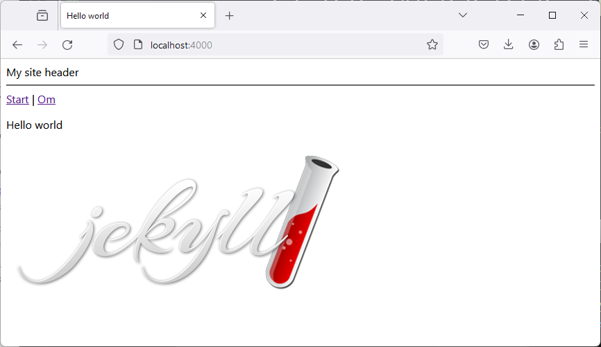

# Docker-Jekyll
@andsju

A repository to setup a Docker environment using Jekyll - a static site generator. 

## Step 1
Clone this repo.

## Step 2
Make sure you have Docker software installed, up and running.

## Step 3
Open a terminal, navigate to git repo root folder. Run command:

```bash
docker-compose up
```

The application should start, open a browser and enter url:

http://localhost:4000/



---

Jekyll site content resides inside folder named *app*. 

```yml
│   about.md
│   index.md
│   _config.yml
├───assets
│   ├───css
│   │       style.css
│   │
│   └───images
│           Jekyll_Logo.png
├───_includes
│       header.html
├───_layouts
│       default.html
└───_posts
```

Visit Jekyll and find out how this generator works.
https://jekyllrb.com/ 